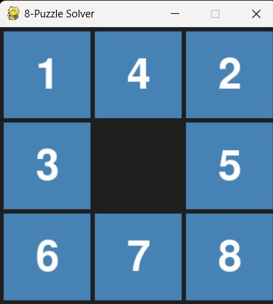

# 8Puzzle Solver

This project is a Python implementation of a solver for the 8-Puzzle game using search algorithms.


## Files

- `8Puzzle.py`: The main file that contains the `Puzzle_state` class and the main function to solve the puzzle.
- `searches.py`: Contains the implementation of the Breadth-First Search (BFS) and A\* search algorithms.

## Usage

To use this project, run the `8Puzzle.py` file. The `main` function initializes a puzzle state and attempts to solve it using the A\* search algorithm.

```python
def main():
    seq: List[str] = [" ", "1", "2", "3", "4", "5", "6", "7", "8"]
    start: Puzzle_state = Puzzle_state(seq)
    solution: Optional[Puzzle_state] = astar(
        start, goal_test, Puzzle_state.get_sucessors, get_manhattan_distance
    )
    if solution is None:
        print("No solution found")
    else:
        path: List[Puzzle_state] = node_to_path(solution)
        for p in path:
            print(p)
```

## Puzzle_state Class

The `Puzzle_state` class represents a state of the 8-Puzzle game. It is initialized with a sequence of strings representing the puzzle state.

```python
class Puzzle_state:

    def __init__(self, sequence: List[str]) -> None:
        self.sequence = sequence
```

## Dependencies

This project requires Python 3.6 or later.
